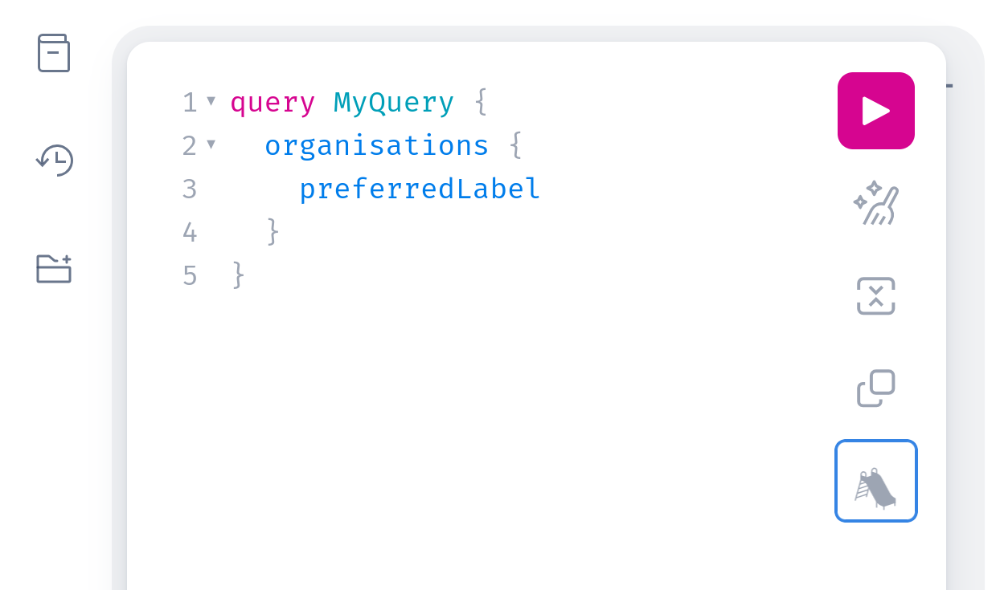
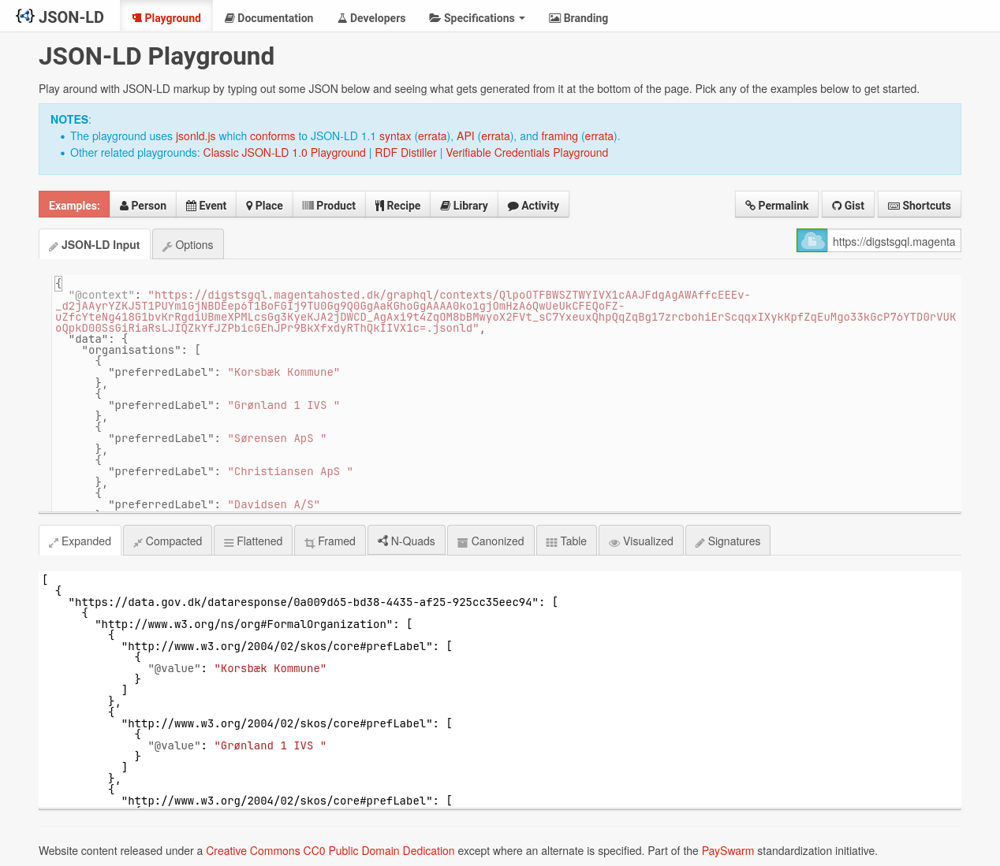

# Semantic GraphQL with JSON-LD

This project explores the potential benefits of combining GraphQL with JSON-LD
to allow users to query linked data using the GraphQL syntax, while leveraging
JSON-LD contexts to define how the data should be semantically interpreted.

[**Linked data**](https://en.wikipedia.org/wiki/Linked_data) is a method of
structuring data on the web to enhance its usability and accessibility. Through
the use of HTTP URIs and
[RDF](https://en.wikipedia.org/wiki/Resource_Description_Framework), it allows
data to be connected, described, and queried semantically, making it more
useful across different applications and systems.

[**JSON-LD**](https://json-ld.org) (JavaScript Object Notation for Linked Data)
is a lightweight format for encoding linked data using JSON. It uses a concept
called a "context" to define how the data maps to an RDF model. For
[example](https://en.wikipedia.org/wiki/JSON-LD#Example), a `Person` with a
`name` property:

```json
{
  "@context": {
    "Person": "http://xmlns.com/foaf/0.1/Person"
    "name": "http://xmlns.com/foaf/0.1/name",
  },
  "@id": "https://me.example.com",
  "@type": "Person",
  "name": "John Smith",
}
```

[**GraphQL**](https://graphql.org) is a query language for APIs, designed to
provide a more efficient and flexible alternative to REST. It allows clients to
request exactly the data they need and nothing more. For example:

**Query**

```graphql
query {
  person {
    name
  }
}
```

**Response**

```json
{
  "data": {
    "person": {
      "name": "John Smith"
    }
  }
}
```

## Constructing the Context

By default, a field's response key in the GraphQL response will use that
field's name. However, the GraphQL spec allows consumers to define a different
response key by specifying an
[alias](https://spec.graphql.org/October2021/#sec-Field-Alias):

**Query**

```graphql
query {
  person {
    navn: name
    nombre: name
  }
}
```

**Response**

```json
{
  "data": {
    "person": {
      "navn": "John Smith"
      "nombre": "John Smith"
    }
  }
}
```

Because aliases are provided by the user at query-time, we cannot simply define
a static context for the whole GraphQL schema which will work for every query.
Instead, to support the dynamic nature of GraphQL, the JSON-LD context is
constructed dynamically based on the user's query. This is done using JSON-LD's
[scoped contexts](https://www.w3.org/TR/json-ld11/#scoped-contexts) to allow
separate context definitions for each GraphQL type. As an example, imagine two
[GraphQL types](https://spec.graphql.org/October2021/#sec-Type-System):

```graphql
type Person {
  name: String
}

type Organisation {
  preferredLabel: String
}
```

with the following query and response.

**Query**

```graphql
query {
  person {
    name
  }
  organisation {
    name: preferredLabel
  }
}
```

**Response**

```json
{
  "data": {
    "person": {
      "name": "John Smith"
    },
    "organisation": {
      "name": "Magenta Aps"
    }
  }
}
```

Even though the user chose conflicting aliases for the `Person.name` and
`Organisation.preferredLabel` fields, scoped contexts allows us to construct a
valid JSON-LD context for the response:

```json
{
  "@context": {
    "data": {
      "@id": "https://data.gov.dk/dataresponse/9b2ee88c-1f19-4215-a245-3c73e3993175",
      "@context": {
        "person": {
          "@id": "http://xmlns.com/foaf/0.1/Person",
          "@context": {
            "name": {
              "@id": "http://xmlns.com/foaf/0.1/name"
            }
          }
        },
        "organisation": {
          "@id": "http://www.w3.org/ns/org#FormalOrganization",
          "@context": {
            "name": {
              "@id": "http://www.w3.org/2004/02/skos/core#prefLabel"
            }
          }
        }
      }
    }
  }
}
```

Because we are using scoped contexts, we need to explicitly define each layer
in the response, including the top-level `"data"` field mandated by the GraphQL
spec. In this project, we have chosen to do so under the
`https://data.gov.dk/dataresponse/` namespace using a randomly-generated UUID
for each response. Future work could include finding a better-fitting semantic
definition for this field.

## Interpreting JSON as JSON-LD

How can the JSON-LD context be returned as part of a GraphQL response? The
GraphQL spec [does not
allow](https://spec.graphql.org/October2021/#sec-Response-Format) top-level
entries other than `data`, `errors`, and `extensions` in the response, so we
cannot simply add a JSON-LD `@context` to the response directly.

Luckily, the JSON-LD spec [defines a
method](https://www.w3.org/TR/json-ld11/#modifying-behavior-with-link-relationships)
to interpret normal JSON documents (which a GraphQL response is) as JSON-LD
through HTTP Link Headers. This enables us to return normal, GraphQL-compliant
JSON to GraphQL consumers, while allowing JSON-LD-aware processors to interpret
the response semantically through a JSON-LD context document served separately
from the GraphQL API.

This is implemented statelessly by encoding the JSON-LD context for a given
GraphQL query as part of the URL in the HTTP Link header of the response.
Furthermore, the JSON-LD context is returned as a [GraphQL `extensions`
field](https://spec.graphql.org/October2021/#sec-Response-Format). This is
solely for human consumption and is ignored by GraphQL and JSON-LD processors.

```http
POST /graphql HTTP/1.1
Host: example.com
Accept: application/json
Content-Type: application/json

{"query": "query { person { name } }"}

====================================

HTTP/1.1 200 OK
...
Content-Type: application/json
Link: <https://example.com/graphql/contexts/anNvbmxkK2dyYXBocWw=.jsonld>;rel="http://www.w3.org/ns/json-ld#context";type="application/ld+json"

{
  "data": {
    "person": {
      "name": "John Smith"
    }
  },
  "extensions": {
    "@context": ...
  }
}
```

## A Semantic GraphQL Schema

GraphQL
[directives](https://spec.graphql.org/October2021/#sec-Language.Directives)
allows annotating the GraphQL schema with additional metadata. For example, the
built-in
[`@deprecated`](https://spec.graphql.org/October2021/#sec--deprecated)
directive is part of the GraphQL spec:

```graphql
type ExampleType {
  newField: String
  oldField: String @deprecated(reason: "Use `newField`.")
}
```

GraphQL servers may add custom directives to their schema. We expose the
semantic definition of each type and field directly on the GraphQL schema
through the use of a custom `@jsonld` directive:

```graphql
directive @jsonld(
  id: String!
  type: String
  container: String
) on FIELD_DEFINITION | OBJECT
```

The directive parameters `id`, `type`, and `container` correspond to the keys
of JSON-LD's [expanded term
definition](https://www.w3.org/TR/json-ld11/#expanded-term-definition) (or the
subset that was needed for this project, at least). Each GraphQL type and field
in the schema is semantically tagged:

```graphql
type Person @jsonld(id: "http://xmlns.com/foaf/0.1/Person", type: "@id") {
  name: String @jsonld(id: "http://xmlns.com/foaf/0.1/name")
}
```

This is what powers the construction of JSON-LD contexts at query-time, but
directives are also available to GraphQL clients through
[introspection](https://spec.graphql.org/October2021/#sec-Introspection), which
is a way to query the schema itself using a GraphQL query. In addition, the
complete GraphQL schema, including all directives, is available in GraphQL
Schema Definition Language (SDL) at
[`/graphql/schema.graphql`](examples/schema.graphql).

### Fallback Types

Types and fields missing the `@jsonld` directive default to a set of simple
types. This is particularly useful for simple scalars such as strings or
booleans.

| Python Type         | Fallback                                            |
| ------------------- | --------------------------------------------------- |
| `bool`              | `http://www.w3.org/2001/XMLSchema#boolean`          |
| `float`             | `http://www.w3.org/2001/XMLSchema#float`            |
| `int`               | `http://www.w3.org/2001/XMLSchema#integer`          |
| `str`               | `http://www.w3.org/2001/XMLSchema#string`           |
| `datetime.date`     | `http://www.w3.org/2001/XMLSchema#date`             |
| `datetime.datetime` | `http://www.w3.org/2001/XMLSchema#dateTime`         |
| `datetime.time`     | `http://www.w3.org/2001/XMLSchema#time`             |
| `decimal.Decimal`   | `http://www.w3.org/2001/XMLSchema#decimal`          |
| `uuid.UUID`         | `http://www.w3.org/TR/sparql11-query/#func-struuid` |
| `strawberry.ID`     | `@id`                                               |

Non-scalars, such as a list, fall back to an opaque [JSON
literal](https://www.w3.org/TR/json-ld/#json-literals)
(`http://www.w3.org/1999/02/22-rdf-syntax-ns#JSON`). This allows the field --
and any of its children which might have proper `@jsonld` directives -- to
still be included in the JSON-LD context.

## A Semantic GraphQL Client

Although it is out of scope of this project to implement a JSON-LD-aware
GraphQL client which utilises the `@jsonld` directive through introspection, we
have taken the time to add _some_ JSON-LD affordances to GraphQL's default
web-based IDE [GraphiQL](https://github.com/graphql/graphiql) in the form of a
button of a slide:



Clicking the button will load the current response into the [JSON-LD
playground](https://json-ld.org/playground/), where it can be inspected:



NOTE: Awaiting merge of
[json-ld/json-ld.org!851](https://github.com/json-ld/json-ld.org/pull/851), the
button currently redirects to a locally-hosted version of the JSON-LD
playground with necessary fixes in place.

## `_id` and `_type`

Although it offers no interoperability with JSON-LD directly, the identifier
and type of most objects is additionally exposed through their `_id` and
`_type` fields. The behaviour of the `_id` field is controlled through the
`@entityTemplate` schema directive, which can be examined by clients through
introspection. The directive defines the namespace and reference (field) used
to construct the `_id` field on objects. For example, the following definition
will produce `_id`s of the format
`https://data.gov.dk/dataentity/<localIdentifier>`, where `<localIdentifier>`
is each object's `localIdentifier` field (most often a UUID):

```graphql
directive @entityTemplate(namespace: String!, reference: String!) on SCHEMA

schema
  @entityTemplate(
    namespace: "https://data.gov.dk/dataentity/"
    reference: "localIdentifier"
  ) {
  query: Query
  mutation: Mutation
}

type FormalOrganisation {
  _id: ID!
  _type: String!
  localIdentifier: ID!
}
```

Note: `@jsonld` directives omitted for brevity.

## Getting Started

```sh
docker compose up -d --build
```

Afterwards, the GraphiQL web IDE will be available at
<http://localhost:8000/graphql>. Use it to load data into the database:

```graphql
mutation {
  loadData
}
```

The code is intentionally well-commented to ease hacking, and the local
development environment automatically reloads the server on code changes. Use
`docker compose logs -f` to see logs.

## Configuration

Parameters without a default value are required when deploying outside the
development (compose) environment.

Available options:

- `DATABASE__USER`
- `DATABASE__PASSWORD`
- `DATABASE__HOST`
- `DATABASE__PORT=5432`
- `DATABASE__NAME`

See `digstsqgl/config.py` for detailed information.

## License

TBD.
